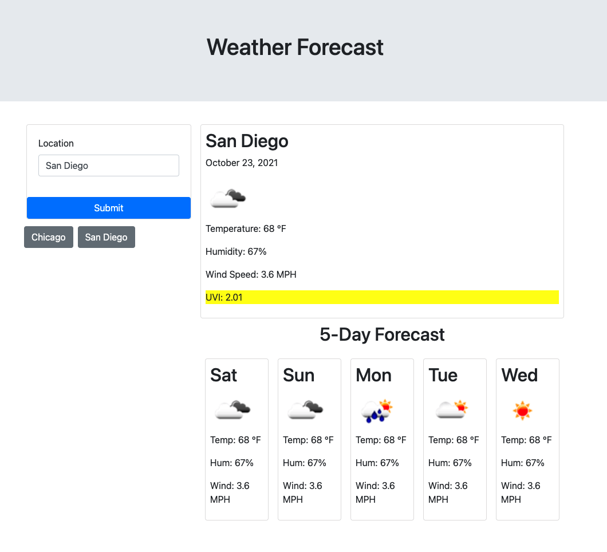

# Weather Forecast App
This app implements the openweathermap API to present the current weather and a 5-day forecast for a user input city name. The previously searched cities are added as a button below the search reagion for quick re-access, and also stored in localStorage between sessions. 

## Features
- User input city search form
- Displays current temperature, weather as an icon, humidity percents, wind speed and UV index (with coloring for severity of UV)
- Displays the 5-day forecast with daily average temperature, weather, humidity, and wind-speed.
- Saves searched cities as buttons below the user form for quick access, and saves session data to localStorage.
- Uses openweathermap api to retrieve forecast data
- Uses moment.js to convert between dates and timestamps

Check out the finished app at: [Weather App](https://ellisonac.github.io/Weather-App/)

Screenshot of the finished page:
